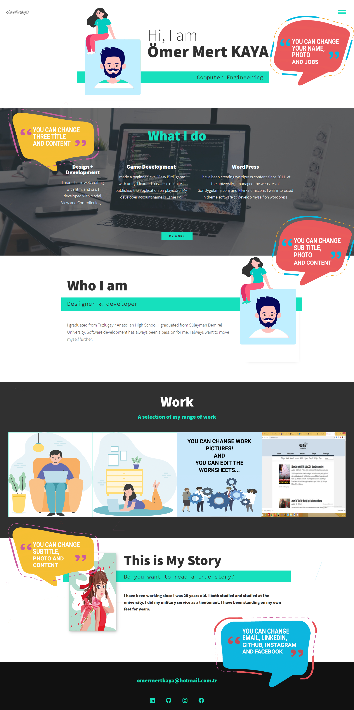

# PORTFOLIO WITH DJANGO

- Front-end coding was done with html vs css.
- Javascript is used in the upper left menu.
- In the Back-End section, development was made with django.

# Do you want to preview my portfolio?

- https://...


# Installation for Windows;

[Click](https://...) to watch the installation video.

...
$ git clone https://github.com/........
...


1) Open "cmd" in project file,

```
$ pip install -r requirements.txt
$ python -m venv virt
$ cd virt
$ cd scripts
$ activate
```

2) Return to project file

```
$ cd ../
$ cd ../
```

3) Run server

```
$ python manage.py runserver
```

4) Create Admin

```
$ python manage.py createsuperuser
```


# Preview




# Source


You can [review](https://www.youtube.com/........) the page for front-end.

You can look [documentation](https://docs.djangoproject.com/en/3.1/) django for back-end.


# Releases

[V.0.0.1](https://github.com/.......)

[V.0.0.2](https://github.com/........)


